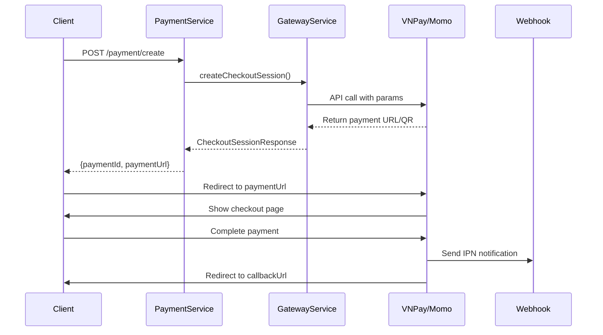

# VNPay & Momo Integration Guide

## Overview

Your payment session workflow is **✅ CORRECT** for VNPay and Momo integration. Both providers support the hosted checkout session pattern with the following flow:

```
1. POST /payment/create → Provider API
2. Provider returns → Payment URL/QR/Deeplink  
3. User redirects → Provider checkout
4. Payment completion → Provider webhook callback
```

## 🇻🇳 VNPay Integration

### **Request Example:**
```json
POST /api/v1/payments/core/create
{
  "orderId": 12345,
  "customerId": 67890,
  "amount": 100000,
  "currency": "VND",
  "callbackUrl": "https://yourapp.com/payment/vnpay/return",
  "cancelUrl": "https://yourapp.com/payment/cancel",
  "description": "Thanh toán đơn hàng #12345",
  "locale": "vn",
  "orderType": "other",
  "customerIp": "192.168.1.100",
  "generateQr": true
}
```

### **Response Example:**
```json
{
  "paymentId": "uuid-123",
  "paymentUrl": "https://sandbox.vnpayment.vn/paymentv2/vpcpay.html?vnp_Amount=10000000&...",
  "qrCodeUrl": "https://img.vietqr.io/image/970415-113366668888-compact2.jpg",
  "sessionId": "vnp_session_123",
  "orderId": 12345,
  "amount": 100000,
  "currency": "VND",
  "status": "pending"
}
```

### **VNPay-Specific Fields:**
- `locale`: "vn" or "en"
- `orderType`: "billpayment", "other", "fashion", etc.
- `customerIp`: Required by VNPay
- `generateQr`: VNPay supports QR codes

## 🇻🇳 Momo Integration

### **Request Example:**
```json
POST /api/v1/payments/core/create
{
  "orderId": 12345,
  "customerId": 67890,
  "amount": 100000,
  "currency": "VND",
  "callbackUrl": "https://yourapp.com/payment/momo/return",
  "cancelUrl": "https://yourapp.com/payment/cancel",
  "description": "Thanh toán Momo #12345",
  "generateQr": true,
  "mobileAppScheme": "momo://payment"
}
```

### **Response Example:**
```json
{
  "paymentId": "uuid-123",
  "paymentUrl": "https://payment.momo.vn/gw_payment/transactionProcessor",
  "qrCodeData": "momo://app?action=pay&token=abc123",
  "deeplink": "momo://payment?token=abc123",
  "transactionId": "momo_txn_123",
  "paymentCode": "MM123456789",
  "orderId": 12345,
  "amount": 100000,
  "currency": "VND",
  "status": "pending"
}
```

### **Momo-Specific Fields:**
- `mobileAppScheme`: For Momo app integration
- `generateQr`: Momo QR code support
- Returns `deeplink` for mobile app redirects

## 📱 Multi-Channel Support

### **Web Payment:**
- User clicks `paymentUrl` → Redirected to provider checkout
- Completes payment → Redirected back via `callbackUrl`

### **QR Code Payment:**
- Display `qrCodeUrl` (VNPay) or generate QR from `qrCodeData` (Momo)
- User scans QR → Opens payment app
- Webhook receives completion notification

### **Mobile App Payment:**
- Use `deeplink` to open Momo app directly
- App-to-app payment flow
- Webhook handles completion

## 🔧 Gateway Service Implementation

Your `PaymentGatewayServiceClient` should implement provider-specific adapters:

```java
// In your Gateway Service
@Service
public class VnPayAdapter implements PaymentGatewayAdapter {
    
    @Override
    public CheckoutSessionResponse createSession(CheckoutSessionRequest request) {
        // Build VNPay parameters
        Map<String, String> vnpParams = new HashMap<>();
        vnpParams.put("vnp_TmnCode", vnpayConfig.getTmnCode());
        vnpParams.put("vnp_Amount", String.valueOf(request.getAmount().multiply(BigDecimal.valueOf(100))));
        vnpParams.put("vnp_TxnRef", request.getOrderId());
        vnpParams.put("vnp_OrderInfo", request.getDescription());
        vnpParams.put("vnp_ReturnUrl", request.getSuccessUrl());
        vnpParams.put("vnp_Locale", request.getVnp_Locale());
        vnpParams.put("vnp_IpAddr", request.getVnp_IpAddr());
        
        // Generate signature and payment URL
        String paymentUrl = vnpayService.createPaymentUrl(vnpParams);
        
        return CheckoutSessionResponse.builder()
            .id("vnp_" + request.getOrderId())
            .url(paymentUrl)
            .status("pending")
            .qrCodeUrl(vnpayService.generateQrCode(paymentUrl))
            .build();
    }
}
```

## 🎯 Webhook Handling

Both providers send webhooks when payment completes:

### **VNPay IPN:**
```
POST /api/v1/payment-webhooks/vnpay
{
  "vnp_Amount": "10000000",
  "vnp_TxnRef": "12345",
  "vnp_ResponseCode": "00",
  "vnp_TransactionStatus": "00",
  "vnp_SecureHash": "signature..."
}
```

### **Momo IPN:**
```
POST /api/v1/payment-webhooks/momo
{
  "orderId": "12345",
  "amount": 100000,
  "resultCode": 0,
  "transId": "momo_txn_123",
  "signature": "signature..."
}
```

## 🔐 Security Considerations

### **VNPay:**
- Verify `vnp_SecureHash` using HMAC SHA512
- Check `vnp_ResponseCode` = "00" for success
- Validate transaction amount and order ID

### **Momo:**
- Verify `signature` using HMAC SHA256
- Check `resultCode` = 0 for success
- Validate partner code and request ID

## 🚀 Complete Implementation Workflow



## ✅ Your Workflow is Ready!

Your implementation correctly supports both VNPay and Momo. The key advantages:

1. **✅ Unified API**: Same endpoint for all providers
2. **✅ Multi-channel**: Web, QR, Mobile app support  
3. **✅ Provider-agnostic**: Easy to add new providers
4. **✅ Webhook ready**: Automatic payment status updates
5. **✅ Secure**: Built-in signature verification support

Just configure your providers in `application.yaml` and implement the gateway service adapters for VNPay and Momo! 🎉 
